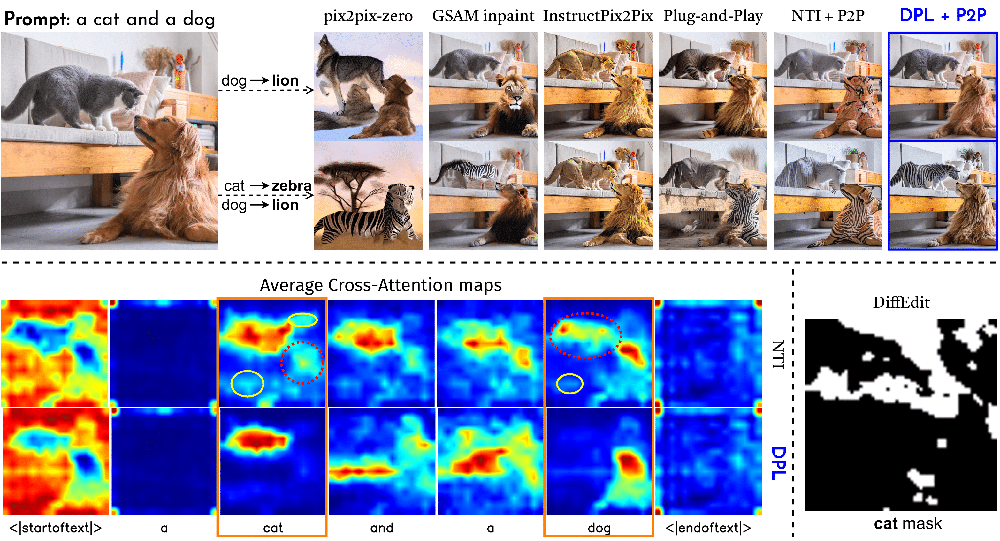
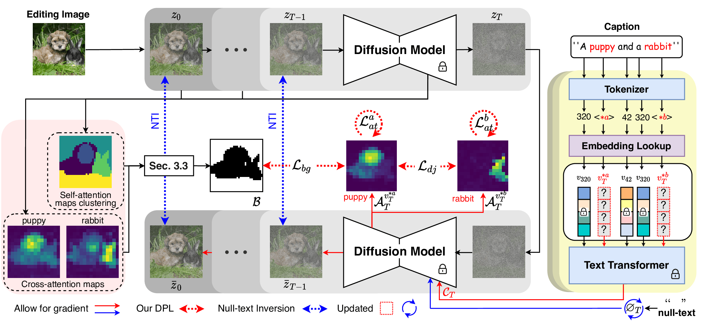

# Dynamic Prompt Learning: Addressing Cross-Attention Leakage for Text-Based Image Editing [(Neurips 2023)](https://neurips.cc/virtual/2023/poster/72801) 

#### [Dynamic Prompt Learning: Addressing Cross-Attention Leakage for Text-Based Image Editing](https://arxiv.org/abs/2309.15664) 

#### [Kai Wang](https://scholar.google.com/citations?user=j14vd0wAAAAJ), [Fei Yang](https://scholar.google.com/citations?user=S1gksNwAAAAJ&hl=en), [Shiqi Yang](https://www.shiqiyang.xyz/), [Muhammad Atif Butt](https://scholar.google.com/citations?user=vf7PeaoAAAAJ&hl=en), [Joost van de Weijer](https://scholar.google.com/citations?user=Gsw2iUEAAAAJ&hl=en)



## Requirments

The required packages are listed in *"torch2.yml"*

### 1. Get captions

For images without captions, we used the [BLIP](https://huggingface.co/docs/transformers/main/model_doc/blip) model to generate image captions. You can change it into [BLIP-2](https://huggingface.co/docs/transformers/main/model_doc/blip-2) for better performance.

```
python _1_BLIP_caption.py --input_image IMAGE_FILE --results_folder ./output
```

### 2. DDIM inversion and feature visualizations

We apply DDIM inversion to get the initial noise and also visualize all attentions and features with clustering or PCA visualization as we showed in the paper.

```
python _2_DDIM_inv.py --input_image IMAGE_FILE --results_folder ./output
```

### 3. DPL inversion

We offer the bash file to run our DPL inversion as below.

```
bash  ./DPL.sh
```

#### Seg/Det DPL inversion (optional)
If you already have the segmentation maps or detection boxes, then we also offer the other choices for the DPL inversion as shown in *"_3_dpl_det_inv.py"* and *"_3_dpl_seg_inv*.py"

### 4. P2P editing

We release our customized P2P editing code in *"_4_image_edit.py"*


### 5. Other comparison methods

For comparison, there are some methods already existing in the *diffusers*, we include them over here by naming as *"comp_XXX.py"*.


## Method Details



## NOTE

- The best hyperparameters may vary for each image, we recommend to explore it for your usage. Actually, after the *"_2_DDIM_inv.py"*, we already save the cross-attention maps. If they have already good qualities, our method *DPL* is not necessary.


- The editing quality cannot be ensured even with perfect cross-attention maps, we will make it as our future job.


## Supplementary Material

[Supplementary Material](supplementary.pdf) is over here.

## TODO

Fulfill this repo with more bash files and example images in the future.

More experimental images are shared via the [Google Drive.](https://drive.google.com/file/d/1o2tMKMM8L04VzTfnCfjW-AiuE1WQJ5GH/view?usp=sharing)